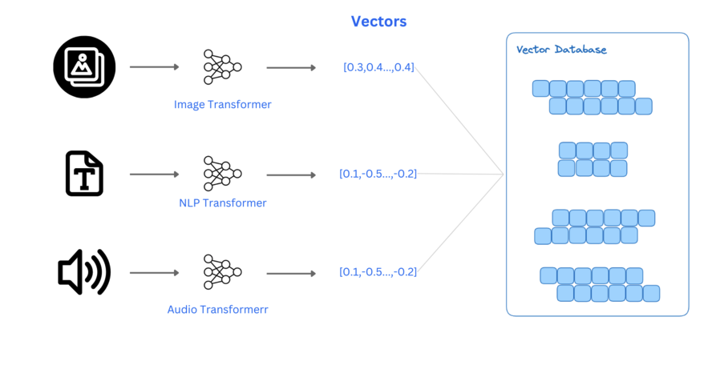
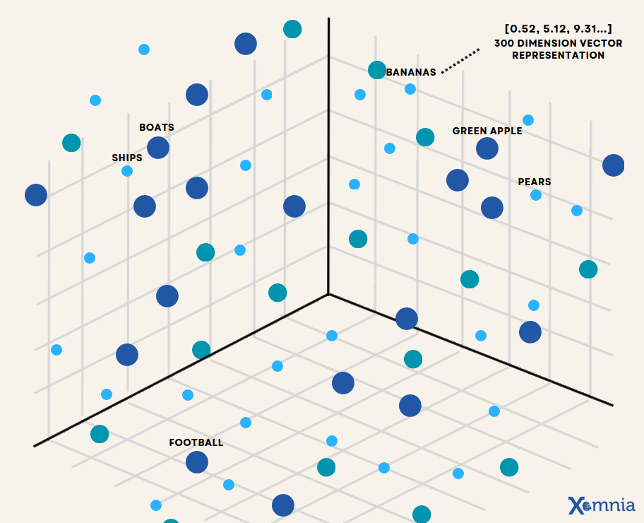
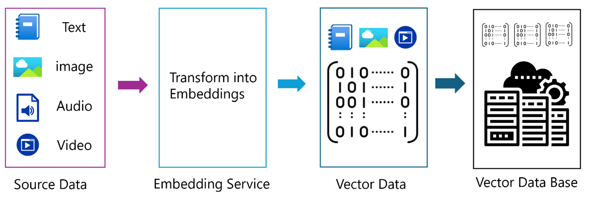
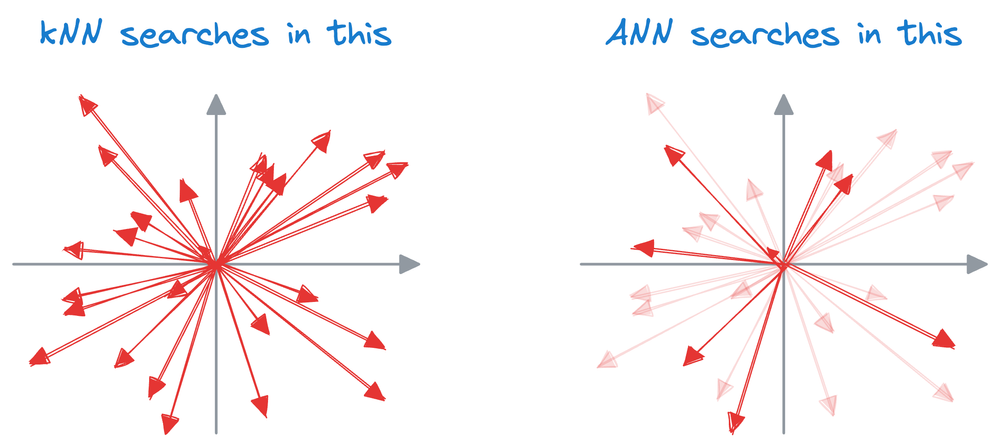
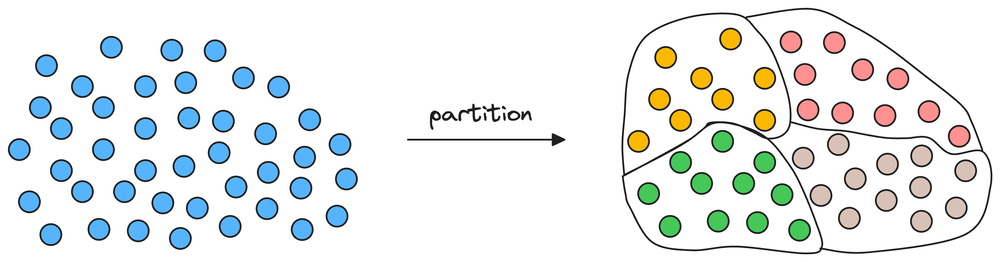
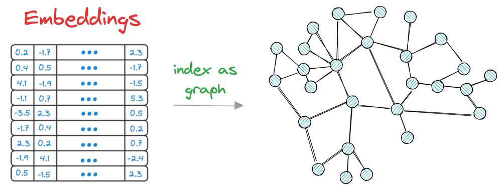

## 🧠 Vector Databases

### What is a Vector Database?

A **vector database** stores unstructured data—such as text, images, audio, and video—as **vector embeddings**.

Each data point (e.g., a word, sentence, image) is transformed into a numerical vector using machine learning models. These vectors—called **embeddings**—capture the semantic and structural features of the original data.

For example, word embeddings often cluster similar concepts together:

* Fruits (apple, banana, mango) may lie close to each other in the embedding space.
* Cities or countries form their own semantic clusters.

This property allows embeddings to **learn relationships and meaning**, provided the underlying model is trained effectively.

Once these embeddings are stored in a vector database, we can perform **similarity searches** to retrieve the most relevant data points based on a query vector.

> A vector DB stores both the embeddings and the original (raw) data, enabling efficient and semantic search over unstructured content.

### 🧭 Evolution of Embeddings

#### 2013–2017: Static Word Embeddings

* Models like **Word2Vec**, **GloVe** were introduced.
* These embeddings captured semantic relationships (e.g., *king* - *man* + *woman* ≈ *queen*).
* Limitation: They were **static**, i.e., the same vector for a word regardless of context.

#### Transformer Era: Contextual Embeddings

* Models like **BERT**, **DistilBERT** introduced **contextualized embeddings**.
* A word’s vector depends on its **context** within the sentence.
* These models powered more nuanced understanding of language.

#### Sentence-Level Embeddings

* Models like **Sentence-BERT** generate embeddings for **entire sentences or paragraphs**, not just individual words.
* These are ideal for tasks like semantic search, similarity detection, and clustering.

### Querying a Vector DB

* When a query is encoded into a vector, it is compared against stored vectors to find similar ones using metrics like:

  * **Euclidean Distance** (lower = more similar)
  * **Manhattan Distance** (lower = more similar)
  * **Cosine Similarity** (higher = more similar)

* This process is similar to the classic **k-nearest neighbors (kNN)** approach.

* A naive (brute-force) method compares the query against every vector in the database, which is computationally expensive and slow for large datasets.

* In real-time systems, this brute-force approach is not feasible due to latency constraints.

* Just like relational databases use **indexing** for fast lookups, vector databases use **Approximate Nearest Neighbor (ANN)** techniques.

* ANN algorithms:

  * Offer a balance between **speed and accuracy**
  * Avoid checking all vectors (non-exhaustive)
  * Are ideal for **large-scale** and **real-time** vector search

Absolutely! Here's a **step-by-step breakdown** of the working of each ANN indexing method, written in your desired format with a bit more detail:

##  Approximate Nearest Neighbors (ANN)

ANN techniques allow fast similarity search by trading off a small amount of accuracy for significant gains in speed and memory.

### 🔹 Flat Index

**Working:**

1. Store all vectors in memory as-is.
2. At query time, compute the exact distance (e.g., Euclidean or cosine) between the query vector and **every** vector in the dataset.
3. Sort the distances and return the top-k nearest vectors.

📌 This is brute-force search with no approximations.

### 🔹 Inverted Index (IVF - Inverted File Index)

**Working:**

1. Apply KMeans clustering to partition the dataset into `K` coarse centroids.
2. Assign each vector to the nearest centroid → forming `K` inverted lists (buckets).
3. Store only the vectors belonging to each centroid in their corresponding list.
4. At query time:

   * Find the `nprobe` nearest centroids to the query.
   * Only search within the vectors in these `nprobe` buckets.
   * Compute distances and return top-k nearest vectors.

📌 Reduces search space by focusing only on relevant clusters.

### 🔹 Product Quantization (PQ)

**Working:**

1. Divide each vector into `M` equal-sized segments (sub-vectors).
2. For each segment position, run KMeans to learn a codebook with `k` centroids.
3. Replace each segment of every vector with the **index** of the closest centroid.

   * This converts each vector into a compact code of `M` integers.
4. At query time:

   * Split the query into `M` segments.
   * For each segment, compute distances to all `k` centroids → build a **distance lookup table**.
   * For each vector’s PQ code:

     * Use the lookup table to sum the distances segment-wise.
   * Return the top-k vectors with the smallest total distance.

📌 Offers massive memory savings and fast search via precomputed distance tables.

### 🔹 HNSW (Hierarchical Navigable Small World Graph)

**Working:**

1. Build a layered graph:

   * Higher layers contain fewer, more general connections.
   * Lower layers have dense, fine-grained connections.
2. During index construction:

   * Insert each new vector while building connections to nearby vectors (based on heuristics).
3. At query time:

   * Start from an entry point in the top layer.
   * Greedily move to neighbors closer to the query.
   * Descend one layer at a time, repeating the search locally.
   * Final result is the nearest neighbors found in the bottom layer.

📌 Extremely fast and accurate due to graph-based greedy traversal.
